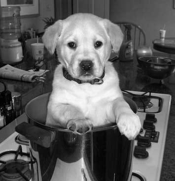
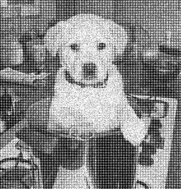

# Image_Enhancement-CS3IA16

# Noise Removal in MATLAB

 

This project is part of the university coursework for the third-year module "Image Analysis." The objective is to gain a deeper understanding of image enhancement techniques in both spatial and frequency domains. The assignment involves developing algorithms to improve the quality of a distorted image (dogDistorted.bmp) by removing or reducing noise, caused by a combination of periodic and random noise.

## Overview

- **Course:** Image Analysis Third-Year Module
- **Language:** MATLAB

## Project Description

### Assignment Goal

The primary goal of this assignment is to implement image enhancement techniques in MATLAB to address the distorted image (dogDistorted.bmp). The distortion in the image is known to be caused by a combination of periodic and random noise.

### Key Steps

1. **Input Images:**

   - Original Image: `dogOriginal.bmp`
   - Distorted Image: `dogDistorted.bmp`

2. **Algorithm Development/Noise Removal Methods:**

   - Develop algorithms in both frequency and spatial domains to enhance the quality of the distorted image.

3. **Performance Evaluation:**
   - Compare the processed image with the original using Mean Squared Error (MSE).
   - Compare the processed image with the original image to visually assess the improvement.

## Usage

To run the MATLAB code:

1. Open MATLAB.
2. Load the project files.
3. Run the main script for noise removal.

## Group Members

[@Samuel Jones](https://github.com/Joness07)

[@Ben Bridgeman](https://github.com/benbridgeman03)

## Additional Notes

- Refer to the assignment description for specific requirements and expectations.
- Explore MATLAB documentation for relevant functions and techniques.
- Ensure all code and documentation are well-organized and adhere to best practices.

Feel free to reach out if you have any questions or feedback.
